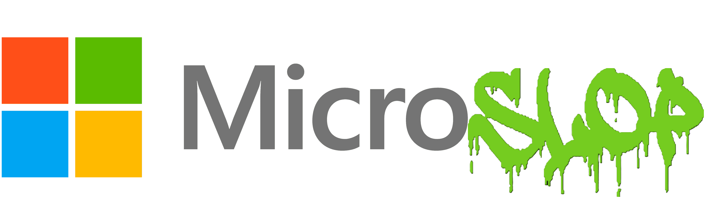
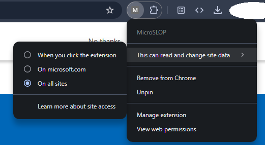
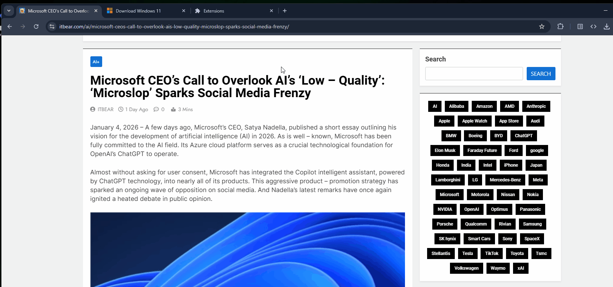

A web browser extension that replaces occurrences of 'Microsoft' with 'Microslop' because, at this point whats the difference.

Note: This is completey inspired by the work of Steven Frank who made 'Cloud to Butt' - https://github.com/panicsteve and my take on that being 'Musk to Belson' which replaced every instance of Elon Musk with Gavin Belson, for obvious reasons...

You can enable it for all web pages, certain ones or only when you turn it 'off and on' by Right Clicking the extension once installed:

## In Action

# Installation

 ̶h̶e̶l̶l̶o̶I̶ ̶h̶a̶v̶e̶ ̶n̶o̶w̶ ̶b̶e̶e̶n̶ ̶a̶b̶l̶e̶ ̶t̶o̶ ̶g̶e̶n̶e̶r̶a̶t̶e̶ ̶a̶ ̶f̶u̶l̶l̶y̶ ̶d̶o̶w̶n̶l̶o̶a̶d̶a̶b̶l̶e̶ ̶C̶h̶r̶o̶m̶i̶u̶m̶ ̶b̶a̶s̶e̶d̶ ̶b̶r̶o̶w̶s̶e̶r̶ ̶.̶c̶r̶x̶ ̶f̶i̶l̶e̶ ̶a̶n̶d̶ ̶a̶l̶s̶o̶ ̶a̶n̶ ̶.̶x̶p̶i̶ ̶f̶i̶l̶e̶ ̶f̶o̶r̶ ̶f̶i̶r̶e̶f̶o̶x̶ ̶b̶o̶t̶h̶ ̶u̶n̶d̶e̶r̶ ̶'̶I̶n̶s̶t̶a̶l̶l̶a̶b̶l̶e̶ ̶E̶x̶t̶e̶n̶s̶i̶o̶n̶s̶'̶!̶

I have learned how to GitHub and pushed an actial release, check out the side column for 'Releases'

Alternatively and if Chrome Blocks you for installing extensions you can, on a chromium based browser click the 3 dots > Extensions > Manage Extensions and click on Enable Developer Mode (top right) > 'Load Unpacked' (top left) > Open the downloaded File Directory (no files will be shown just hit submit).

---

My dream is to bring this to all web browsers... as it should be!

Full Note:
I do like Microsoft, they were the first real operating system that I got to play with (95) and I really hate what they are doing to it. 

They are literally destroying their own name and their own brand. 

I do support them but I can’t keep supporting them. They’re making it so hard to still like them. 

I mean don’t get me wrong. I have friends that work at Microsoft. They are awesome people. 

It’s not the people it’s the product, you need to fix the product and listen to what the people (remaining emplyees and general public you sell this to) actually want (spoiler: it’s not AI jammed into every aspect of the OS and app)
